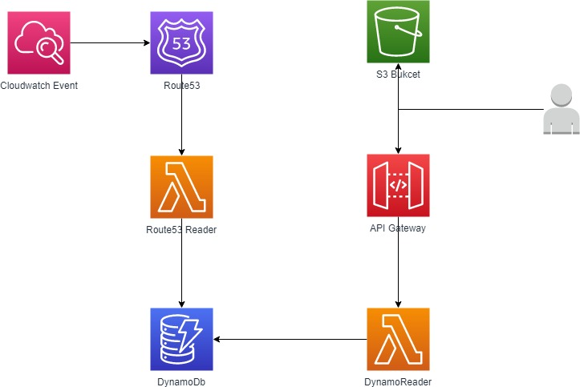

# aws-app

This repo contains an application that reads data for Route 53 records and displays this on a webpage. This website is serverless, meaning that the only costs that will be charged will be when people hit the website. Making it serverless also means there is much less to manage, all the overhead rests with AWS. Using DynamoDB over RDS also means we have more flexibility with what data we want to store from Route53. 

The architecture components are:
- Lambda: There are two lambda functions in use, one to query route53 and update dynamoDB and the other that gets called by the website when it's hit to dynamically create the table with the Route53 tables
- API Gateway: The website created hits an API Gateway, which calls the lambda functions to get the route53 details from DynamoDb. As the S3 bucket is on a different domain, CORS is required to make sure this works. I had no problems enabling it when I click-ops'd the gateway, however had some problems doing this as code so this is a gap
- DynamoDB: DynamoDb only stores a few of the Route53 field currently, however the lambda function can easily be updated to store more.
- Cloudwatch Alarm: The CloudWatch alarm triggers the lambda function every 3 hours, 

Order of CloudFormation Deployment:
1. Dynamodb
2. Lambdas (dependent on DynamoDb to create Lambda)
3. API Gateway (dependent on Lambda ARNs to be able to call functions)
4. Cloudwatch-events (dependent on lambda function existing)

# To-do
- Work on CORS set-up as code to enable proper deployment of API
- Set-up a CI/CD pipeline to automatically build, package deploy (without having to use/deploy anything extra for this little project probably would have used GitHub actions and code build/code deploy in AWS)
- Remove the hardcoded ID's and pass through the outputs of CloudFormation templates
- Setup a proper DNS to front the website (rather than just the S3 bucket URL to access the website)
- Consider authentication: This will depend on who needs access, Amazon Cognito is the easiest native AWS service used to manage users. This would involve create a user pool to manage accounts (if users are registering for access or using a web federation). If using active directory, it would be some sort of SAML auth (harder)
- Add tags to resources to be able to appropriately identify/manage these